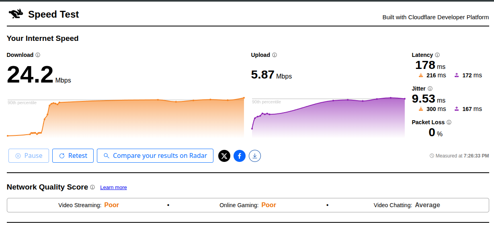
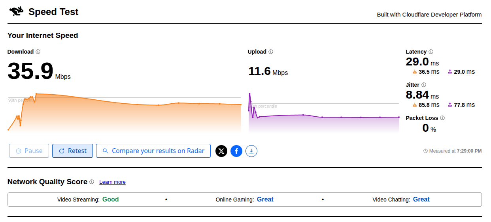

# betterconn (v1.0.6)
Linux network optimizer focused on Debian. Maximizes connection quality for gaming, streaming, and general use by applying proven kernel-level and traffic tuning at runtime, with adaptive real-time adjustment and full backup and restore of original settings. Written by Christian (@pusheandoando)


## Real-world results
Measured on a 20 Mbps WiFi link using [Cloudflare Speed Test](https://speed.cloudflare.com/), the recommended tool to benchmark your connection before and after applying betterconn.

<div align="center">

### Default (no betterconn)


### Optimized (betterconn active)


</div>

| Metric | Default | With betterconn | Change |
|---|---|---|---|
| Download | 24.2 Mbps | 35.9 Mbps | +48.3% |
| Upload | 5.87 Mbps | 11.6 Mbps | +97.6% |
| Latency | 178 ms | 29.0 ms | −83.7% |
| Loaded latency (down) | 216 ms | 36.5 ms | −83.1% |
| Loaded latency (up) | 172 ms | 29.0 ms | −83.1% |
| Jitter | 9.53 ms | 8.84 ms | −7.2% |
| Packet Loss | 0% | 0% | Same |

| Quality Score | Default | With betterconn |
|---|---|---|
| Video Streaming | Poor | Good |
| Online Gaming | Poor | Great |
| Video Chatting | Average | Great |


## What it does
- **TCP BBR** congestion control — measures actual bandwidth and RTT instead of relying on packet loss, reducing latency and improving throughput — [ACM Queue](https://queue.acm.org/detail.cfm?id=3022184)
- **fq_codel** queue discipline — active queue management with per-flow isolation; eliminates bufferbloat without a rate cap, making it correct for endpoint use — [RFC 8290](https://datatracker.ietf.org/doc/html/rfc8290), [WiFi 6 AQM study 2025](https://arxiv.org/abs/2512.18259)
- **TCP ECN** — routers signal congestion by marking packets rather than dropping them, pairs directly with fq_codel — [RFC 3168](https://datatracker.ietf.org/doc/html/rfc3168)
- **TCP Fast Open** (value 3) — reduces connection setup round-trips — [RFC 7413](https://datatracker.ietf.org/doc/html/rfc7413)
- **RX/TX socket buffers** — dynamically sized by the adaptive tuner based on measured real-time throughput, from 4 MB (slow links) up to 32 MB (fast links)
- **tcp_autocorking disabled** — sends each write immediately, cutting queuing delay for interactive and gaming traffic — [LWN](https://lwn.net/Articles/576263/)
- **tcp_notsent_lowat** — tuned dynamically to reduce application-level buffering and keep request latency low
- **tcp_slow_start_after_idle = 0** — BBR does not throttle connections that were briefly idle
- **WiFi power save disabled** — prevents 20–100 ms idle latency spikes caused by the card sleeping between beacon intervals; made permanent via NetworkManager so it survives reconnects
- **Adaptive NIC interrupt coalescing** via ethtool — dynamically balances interrupt rate between low latency and high throughput
- **iptables TOS 0x10** (Minimize Delay) for DNS, HTTP/S, Steam, and common game UDP ports — [RFC 791](https://www.rfc-editor.org/rfc/rfc791)
- **Real-time adaptive tuner** — runs as a background daemon; reads `/proc/net/wireless` (RSSI, TX retries), `/proc/net/dev` (live throughput), and RTT via ping, then adjusts buffers, `netdev_budget`, `tcp_notsent_lowat`, and the fq_codel target without any user interaction
- **WiFi channel survey monitoring** — periodically samples `iw dev <iface> survey dump`, a standard mac80211 API (`NL80211_CMD_GET_SURVEY`) exposed by essentially every Linux WiFi driver with no firmware patching or special hardware required, to read per-channel busy/receive/transmit time and noise floor; this lets the tuner anticipate ambient airtime congestion and preemptively tighten the fq_codel target and retry-sensitive buffering before it shows up as RTT or retry spikes on the local link — [Ending the Anomaly, USENIX ATC 2017](https://www.usenix.org/conference/atc17/technical-sessions/presentation/hoilan-jorgesen), [Law, USENIX NSDI 2026](https://www.usenix.org/conference/nsdi26/presentation/shen-yibin), [Mortise, USENIX NSDI 2026](https://www.usenix.org/conference/nsdi26/presentation/shen-yixin)
- **Adaptive tiered traffic prioritization** — replaces the flat `fq_codel` root qdisc with an `htb` hierarchy split into four bandwidth tiers (Hot, Warm, Cool, Cold), each with its own `fq_codel` leaf so per-flow fairness is preserved within every tier; a background thread polls the currently focused window every 500 ms and combines focus state, recent input activity, and live per-process network activity into a continuously updated priority score for every observed process, moving each PID into the `cgroup v2` control group matching its current tier (tagged with `iptables -m cgroup --path -j MARK`), with hysteresis and minimum dwell time applied before a process changes tier to avoid rapid oscillation, and periodic bandwidth rebalancing across tiers based on aggregate tier demand — [net_cls/net_prio kernel docs](https://docs.kernel.org/admin-guide/cgroup-v1/net_cls.html), [cgroup v2 xt_cgroup match, LWN](https://lwn.net/Articles/679786/), [tc-htb(8)](https://man7.org/linux/man-pages/man8/tc-htb.8.html)

Focused-window detection uses `xdotool` on X11 sessions. On Wayland, Wayland's security model deliberately does not expose a compositor-agnostic way for a client to query the focused window's PID, so betterconn queries the compositor's own IPC instead: `swaymsg` for Sway and other wlroots-based compositors, and `hyprctl` for Hyprland. The correct backend is detected automatically at startup, in that order, with no configuration needed. On compositors without a supported IPC (for example GNOME/Mutter or KWin), this feature degrades gracefully and all traffic falls back to the lowest priority tier. In addition to focus tracking, betterconn also predicts companion processes that tend to be used alongside the focused one (for example a game and its voice-chat client) by detecting alternating focus patterns over time, and pre-promotes their priority tier accordingly.


## Security notice
betterconn prioritizes maximizing internet speed and stability over network security, betterconn is designed for trusted networks only (home, personal workplace). Do not use it on public networks such as airports, hotels, cafes, or universities where untrusted devices share the same network segment.

betterconn also runs a background thread that polls the currently focused window every 500 ms, via `xdotool` on X11 or via the compositor's own IPC on supported Wayland compositors (`swaymsg` for Sway/wlroots, `hyprctl` for Hyprland), feeding a scoring engine that ranks every observed process into one of four bandwidth tiers (Hot, Warm, Cool, Cold) based on focus recency, input activity, and live network activity. This means the process ID of whichever application is currently focused, along with the PIDs of other processes with detected network activity, is continuously read for as long as betterconn is running. This data never leaves the machine, is not written to persistent storage beyond the transient cgroup assignment, and stops the moment `betterconn stop` is run.

The following settings applied by betterconn reduce your security posture:
- **TCP timestamps** — can expose system uptime to remote hosts
- **TCP Fast Open** — slightly weakens SYN-flood protection
- **Ephemeral port range widened** to 1024–65535
- **Socket buffer sizes increased** significantly, raising per-connection memory usage
- **iptables TOS marking** applied to DNS, HTTP/S, and common game ports
- **WiFi power saving disabled** permanently via NetworkManager


## Requirements
### Runtime dependencies
```bash
sudo apt install iptables iproute2 kmod iputils-ping ethtool iw xdotool
```
Kernel 4.9 or newer required for BBR (Debian 9+ ships this by default).

### Build dependencies
```bash
sudo apt install build-essential cmake
```
CMake 3.16+, GCC with C++17 support (GCC 8+). No external libraries needed.

## Build
```bash
chmod +x build.sh
./build.sh
```

## Build a .deb package
```bash
chmod +x build_debian.sh
./build_debian.sh
```


## Usage
- Apply all optimizations and start the adaptive daemon. Persists across reboots:
```bash
sudo betterconn start
```
- Revert all settings to their original values, clean all residual files, and reboot:
```bash
sudo betterconn stop
```
- Show live stats: speed, ping, and current kernel settings:
```bash
sudo betterconn status
```
- Remove all betterconn files from the system (only if already stopped):
```bash
sudo betterconn clean
```


## Persistence
`betterconn start` survives reboots, forced shutdowns, and power loss. On apply, betterconn writes:
- `/etc/modules-load.d/betterconn.conf` — loads `tcp_bbr` and `xt_TOS` early at boot
- `/etc/sysctl.d/99-betterconn.conf` — all kernel parameters, applied by `systemd-sysctl` at every boot
- `/etc/betterconn/iptables-apply.sh` — re-applies QoS rules, qdisc, and WiFi power save after boot
- `/etc/systemd/system/betterconn.service` — systemd unit that runs the boot script then starts the adaptive daemon

`betterconn stop` removes all of the above, stops the daemon, reverts `/proc/sys` to the saved backup, restores the original NIC coalescing state, and removes the iptables rules. After `stop`, rebooting leaves no trace of betterconn.